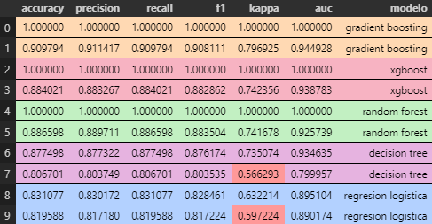
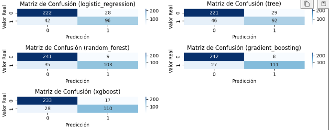
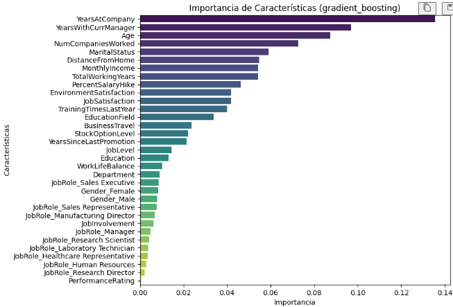
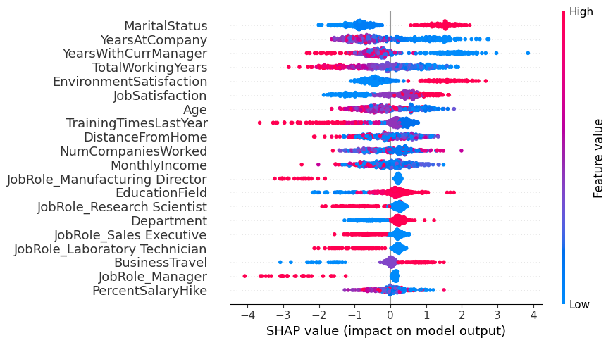
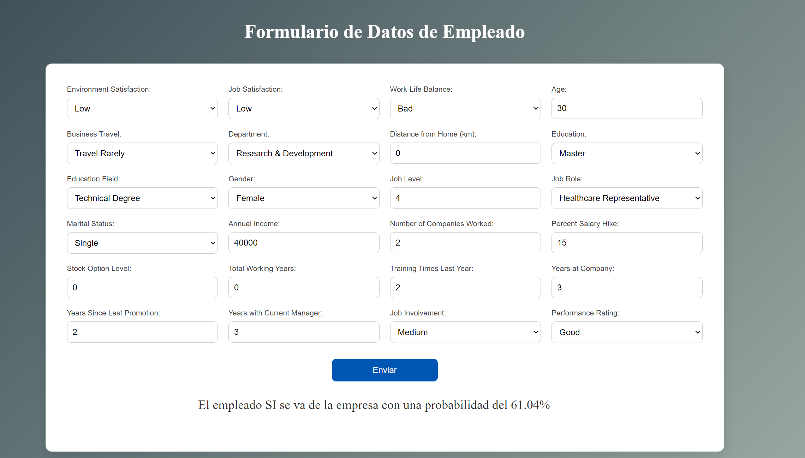

# Predicción de Retención de Empleados 🏢


En este proyecto nos ponemos en la piel de Recursos Humanos y nos enfrentamos a uno de los mayores dolores de cabeza de cualquier empresa: la rotación de empleados. ¿Por qué algunas personas deciden quedarse mientras otras se van? ¿Será el salario? ¿Las horas extra? ¿La relación con su jefe?

## Introducción
La rotación de empleados es un desafío crítico para cualquier organización. A través de este proyecto, se busca predecir si un empleado permanecerá en la empresa o no, analizando factores como satisfacción laboral, desempeño y características demográficas.

El objetivo principal es construir un modelo predictivo de machine learning que, además de ofrecer una buena precisión, permita entender los factores que más influyen en la retención y rotación de empleados.

La variable respuesta en el proyecto corresponde a `Attrition` la cual indica con un 1 si un empleado abandona la empresa y un 0 el caso contrario. Es dicha variable la que trataremos de predecir.

## Estructura del Proyecto

Para el desarrollo del proyecto se han llevado a cabo 8 modelos distintos, para mayor información sobre cada modelo como: en qué modelo se basa y diferencia respecto al resto o sus mésticas consultar el pdf `MetricasModelos`.
Dentro de cada modelo podemos encontrar tres carpetas:

1. **datos**

    Donde encontramos los csv originales de los datos y otras dos carpetas:
    - `dataframes`:  donde se almacenan los diferentes dataframes generados en cada fase del modelo.
    - `preprocesamiento`: donde almacenamos el encoder o scaler utilizados n dicho modelo

2. **src**

    Podemos encontrar todos los archivos .py con las fuciones de soporte para cadapartedel modelo.

3. **notebooks**

    Donde se encuentran las distintas fases de la creación del modelo.
    - `1-EDA-nulos.ipynb`
    - `2-encoding.ipynb`
    - `3-outliers.ipynb`
    - `4-estandarizacion.ipynb`
    - `5-balanceo.ipynb`, aunque hay algunos modelos que no cuentan con este notebook.
    - `6-modelos.ipynb`, en este notebook se pueden encontrar las métricas obtenidas para dicho modelo.

4. **Modelo_.txt**

    Cada modelo tiene un txt explicando más en profundidad como se han tratado los datos y las diferencias que hay respecto al modelo en el que están basados.


## Resumen del proyecto

Tras probar varios modelos podemos concluir que lasmejors métricas obtenidas son las del `Modelo4`. Para este modelo el preprocesamiento de los datos fue el siguiente:

- **EDA**
    - Tras eliminar el EmploeeID eliminamos los duplicados.
    - Gestión de nulos: Hemos eliminado los nulos de las numéricas que representaban un 1.78% y los nulos de las categoricas las hemos imputado por "sin informacion".

- **Encoding**:
    - Devuelvo a numéricas: ['Education', 'JobLevel', 'StockOptionLevel', 'PerformanceRating', "TrainingTimesLastYear", "JobInvolvement"]
    -  "onehot":["Gender", 'JobRole']
        "target":['EnvironmentSatisfaction', 'JobSatisfaction', 'WorkLifeBalance', 'BusinessTravel', 'Department', 'EducationField',  'MaritalStatus']

- **Outliers**:
    - Detección con IFO.
    - Eliminamos los que cumplen que son outliers en al menos el 70% de los casos, estos representan un 1.62%.

- **Estandarizacion**:
    - Estandarizado con robust scaler

- **Balanceo**
    - Obtenemos un balanceo del 62-37 aplicando primero el Tomek link y después el smotenc.

Una vez llevado a cabo todo este preprocesamiento se probaron varios modelos de clasificación como la regresión logística, el descision tree, el random forst, el gradient boosting y el xgboost. Finalmente las métricas obtenidas fueron las siguientes:



Como podemos observar el modelo que mejor funciona es el gradient boosting con un **accuracy, precisión y recal de 0.9** y una **kappa de 0.8**. Además, la métrica que más queremos priorizar es recall pues nos interesa minimizar los falsos negativos, es decir, queremos el menor número de prediciiones que digan que un empleado no se va de la empresa y finalmente se va. Si observamos las matries de confusión para las distintas métricas el gradiente boosting es la que arroja un menor número de falsos negativos.



En los distintos modelos se prueban diferentes formas de gestionar los otliers, el encoding, la estandarización o el balanceo, sin embargo, es en este modelo donde mejores métricas se han obtenido.

Una vez hemos concluido que el gradient boosting del Modelo4 es el mejor, almacenamos el modelo y lo entrenamos con todos los datos dentro del notebbok `6-modelos.ipynb` en el Módulo4. Además, encontraremos un notebook adicional que es el `7-prediccion.ipynb` donde nos inventamos unos datos ficticios y comprobamos que se hagan las predicciones correctamente.

Finalmente, para hacer una interfaz más amigable a la hora de hacer las predicciones se ha creado una API con Flask dentro de `src/main.py` la cual renderiza un html a través del cual le podemos meter las distintas métricas para un empleado y predecir con que probabilidad abandona o no la empresa.

## Conclusiones 

Tras obtener nuestro mejor modelo lo que más nos interesa saber es: ¿cuales son los factores que más influyen a la hora de hacer la predicción? ¿Qué valores se toman para cada categoría e las personas que deciden abandonar una empresa?

La primera pregunta la podemos responder viendo la gráfica de la impotancia de los predictores:



Como podemos observar los predictores que mayor peso tienen a la hora de genera el modelo son: YearsAtCompany, YearsWithCurrentManager, Age, NumCompaniesWorked y MaritalStatus. Las primeras no nos sorprenden que parezcan juntas pues como se ve en el EDA las dos primeras estan bastante correlacionadas, sin embargo, Maritalstatus si que me llama la atención. Por otro lado lo que menos parece influir es el JobInvolment, el género y el JobRole.

Contestemos a la segunda pregunta, para ello usaremos el gráfico shap:



Veamos como los valores de cada variable influye y en que nivel para que una persona abandone la compañía. Para entender los valores de MaritalStatus tenemos que volver al notebook 2 y ver a que valores corresponde cada categría, vemos que Single es la más alta y casado y divorciado tienen valores muy similares. Por lo tanto las personas solteras son más propensas a irse de la compañía.
También podemos ver que aquellos que llevan menos años en la compañía, con su manager y en general menos años trabajando también son más propensos a irse, lo que coincide con las personas más jovenes. También podemos destacar que aquellas que tienen mayor nivel de estudios o las que tienden a viajar más suelen tener un porcentaje más alto para irse de la empresa. 

Por lo tanto, hemos visto cuales son las que más afectan y también dentro de categoría para que valores suele haber más porcentaje de abandono. también hemos podio observar que métricas que en un primer momento no podían parecer decisorias como EnvironmentSatisfaction o Jobsatisfaction resulta que aquellos trabajadores que les dan valores más altos tiene mayor probabilidades de irse. Por lo que estos gráficos aportan una información de gran valor a la empresa a la hora de identificar en qué clase de perfiles incidir más para cambiar esas tendencias de abandono.


## Instalación y Requisitos
Este proyecto usa Python 3.11 y requiere las siguientes bibliotecas:
- [numpy](https://numpy.org/doc/stable/)
- [pandas](https://pandas.pydata.org/docs/reference/frame.html)
- [matplotlib.pyplot](https://matplotlib.org/3.5.3/api/_as_gen/matplotlib.pyplot.html)
- [seaborn](https://seaborn.pydata.org/)
- [shap](https://shap.readthedocs.io/en/latest/)
- [flask](https://flask.palletsprojects.com/en/stable/)
- [scikitlearn](https://scikit-learn.org/stable/)
- [imblearn](https://imbalanced-learn.org/stable/)
- [itertools](https://docs.python.org/3/library/itertools.html)
- [warnings](https://docs.python.org/3/library/warnings.html)

Este proyecto es funcional a fecha 1 de diciembre de 2024.


Para visualizar el proyecto en tu máquina local, sigue estos pasos:

1. **Clona el repositorio**:
   ```bash
   git clone [URL del repositorio]

   Instala las dependencias en tu entorno de Python.
   
2. **Navega a la carpeta del proyecto**:
   ```bash
   cd Proyecto8-PrediccionRetencionEmpleados

2. **Ejecutar o visualizar los archivos**:
   Accede a cualquier carpeta de los modelos y dentro ve a la carpeta `notebooks` y ejecuta o visualiza los archivos en el orden especificado.

   Para realizar predicciones accede a `Modulo4/src` y ejecuta:
   ```bash
   python main.py
   ```
   Abre el navegador e introduce la siguiente URL http://127.0.0.1:5000, introduce los datos deseados y pulsa "Enviar", a continuación aparecerá la predicción para los datos proporcionados.

   

